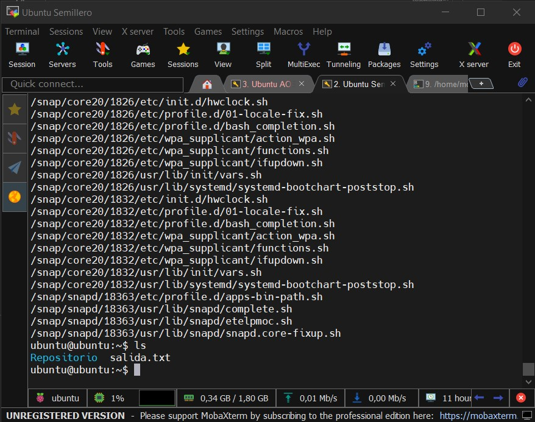
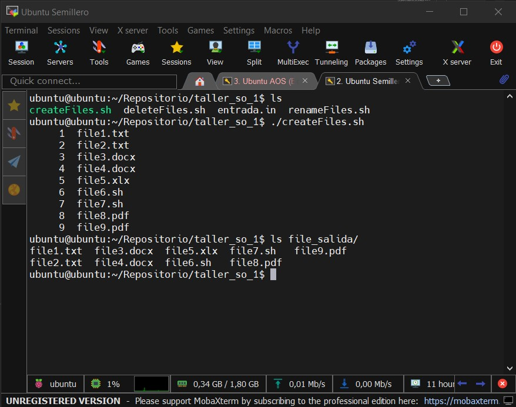
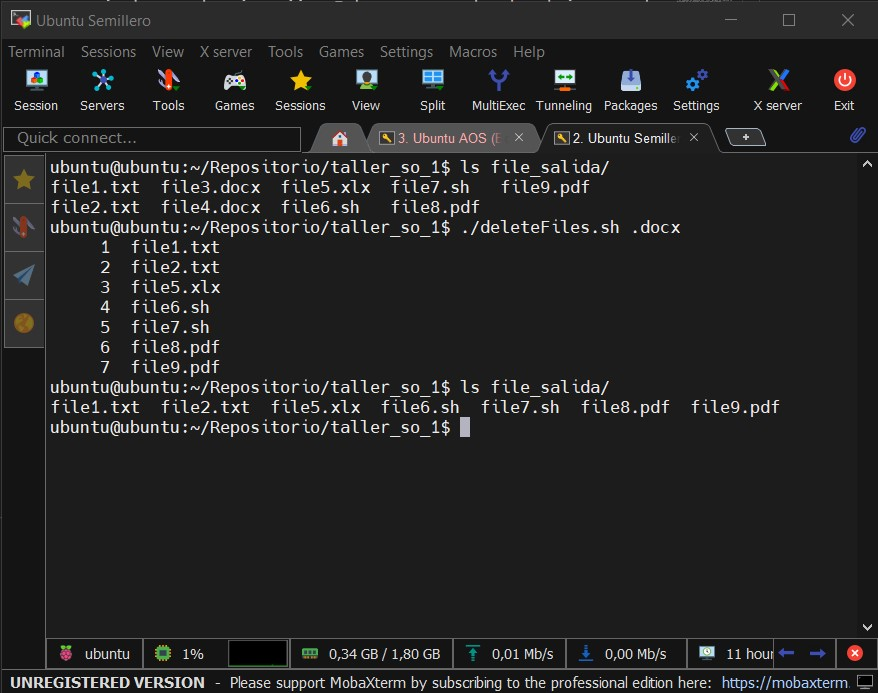
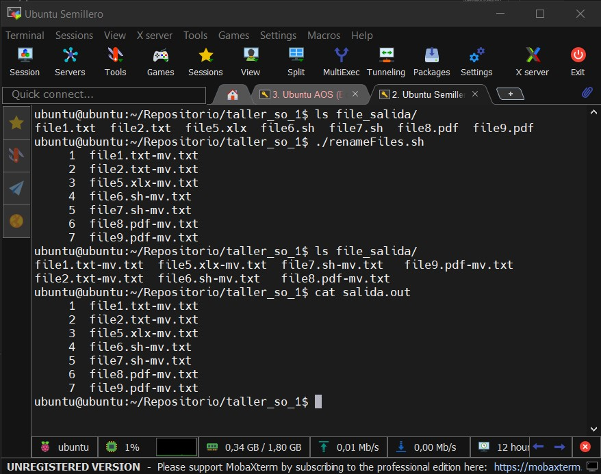

# ***SEMILLERO DEVOPS - BANCO POPULAR***
## **Taller - Manejo de Archivos - Sistemas Operativos**
#### **Elaborado por:** *Edward Alonso Villamil Avellaneda*
-------------

[**Perfil de Edward Villamil**](https://eavillamila.github.io/Personal-Profile-Edward-Villamil/)

-------------
A continuación, se describe el desarrollo del taller sobre manejo de archivos del módulo de Sistemas Operativos. La actividad estuvo bajo la guía y apoyo del ingeniero DevOps [**Edisson Giovanni Zuñiga**](https://giovanemere.github.io/Edisson-Giovanni-Z-Lopez/). Los scripts Shell están ubicados en la siguiente carpeta:
**Scripts Taller 1:** [**taller_so_1/**](https://github.com/eavillamila/semilleroDevOps/tree/main/taller_so_1)

## *Buscar Archivos*
Esta primera parte del taller nos pide realizar una busqueda de los archivos con extensión ".sh" dentro de la carpeta /, para luego guardar el listado en un archivo de salida y mostrar en consola su contenido. Todo esto se debe realizar en una única línea de comando. El resultado es el siguiente:

    sudo find / -iname "*.sh" > salida.txt ; cat salida.txt

* El comando se ejecuta con `sudo` porque se realiza la bsuqueda en la carpeta principal del sistema. 
* La opción `-iname` establece una búsqueda por nombre sin importar si se tratan de minúsculas o mayúsculas. 
* La expresión `"*.sh"` es una expresión regular (redex) que hace referencia a cualquier archivo con el formato deseado. 
* El símbolo `>` indica que la salida del comando se debe guardar como contenido del archivo `salida.txt`.
* Por último, se incluye el comando `cat salida.txt` separado por `;`, ya que de esta forma se ejecutan de manera continua sin usar otra línea.

Por ser un único comando, no se incluyo un script Shell. El resultado obtenido de ejecutarlo es el siguiente:

## *Creación de Archivos*
La segunda parte del taller nos pide crear un script que lea un archivo `entrada.in`, y cree archivos con los nombres que indica cada línea de su contenido dentro de la carpeta `file_salida`. Luego, se deben listar los archivos creados, guardar la salida en un archivo `salida.out` y, por último, imprimir su contenido enumerando cada línea.

El resultado es el script `createFiles.sh`. Lo único que se requiere para su ejecución es disponer del archivo entrada.in dentro de la misma carpeta. Se incluye un archivo de ejemplo o prueba. Recuerda darle permisos de ejecución al script así:

    chmod +x createFiles.sh

Recuerda que para ejecutarlo tienes las siguientes opciones:

    ./createFiles.sh
    bash createFiles.sh

El resultado obtenido de su ejecuación fue el siguiente:

## *Eliminar de Archivos*
La tercera parte del taller nos pedia volver a leer el archivo `entrada.in` y utilizar un patrón para identificar ciertos nombres de archivos, que luego debían ser eliminados de la carpeta `file_salida/`. Después, se lista el contendio de la carpeta y se guarda el resultado en un archivo (se empleo el mismo `salida.out`).

Para el desarrollo de este script shell se hace uso de un parámetro en la ejecución. Este corresponde al patrón con el que se realizará la identificación de los archivos a eliminar.

Recuerda darle permisos de ejecución al script así:

    chmod +x deleteFiles.sh

Recuerda que para ejecutarlo tienes las siguientes opciones:

    ./deleteFiles.sh patron
    bash deleteFiles.sh patron

El resultado obtenido de su ejecuación fue el siguiente:

## *Renombrar Archivos*
La última parte del taller solicitaba cambiar el nombre de los archivos, agregando `"-mv.txt"` al final. Luego, se deben listar los archivos, guardar la salida en `salida.out` y imprimir en consola.

Recuerda darle permisos de ejecución al script así:

    chmod +x renameFiles.sh

Recuerda que para ejecutarlo tienes las siguientes opciones:

    ./renameFiles.sh
    bash renameFiles.sh

El resultado obtenido de su ejecuación fue el siguiente:

------
#### **Esperamos que está documentación haya sido útil.**
### ***Gracias por visitar y valorar nuestro trabajo...***