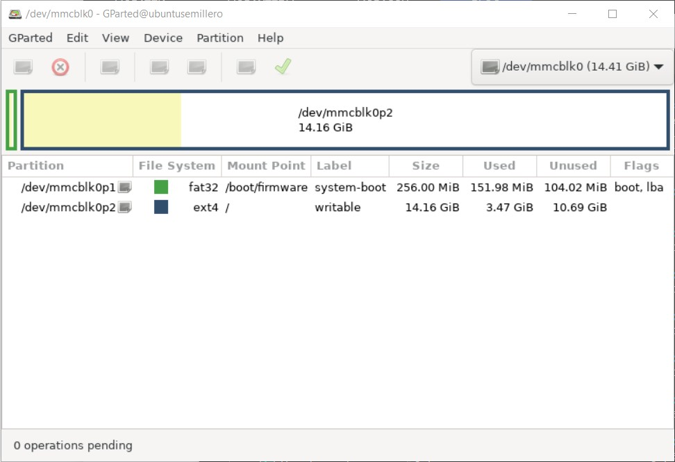
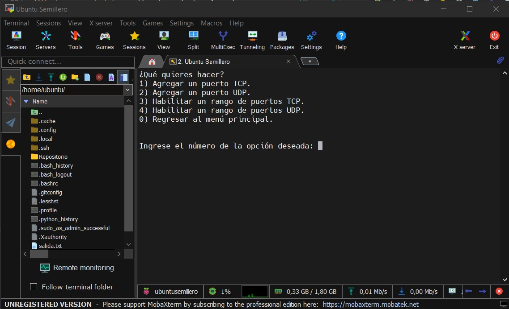

# ***SEMILLERO DEVOPS - BANCO POPULAR***
## **Taller - Manejo de Archivos - Sistemas Operativos**
#### **Elaborado por:** *Edward Alonso Villamil Avellaneda*
-------------

[**Perfil de Edward Villamil**](https://eavillamila.github.io/Personal-Profile-Edward-Villamil/)

-------------
A continuación, se describe el desarrollo del taller sobre administración de sistemas operativos del módulo de Sistemas Operativos. La actividad estuvo bajo la guía y apoyo del ingeniero DevOps [**Edisson Giovanni Zuñiga**](https://giovanemere.github.io/Edisson-Giovanni-Z-Lopez/). Los scripts Shell están ubicados en la siguiente carpeta:
**Script Taller 2:** [**TALLER2.md**](https://github.com/eavillamila/semilleroDevOps/tree/main/taller_so_2)

------------
Este taller consistía en crear un menú a través de un script Shell, donde se realizan 8 diferentes acciones de administración dentro de un sistema operativo linux. Cabe aclarar que este código se desarrollo desde y para un sistema operativo **Linux Ubuntu 22.04 Server LTS**. Su uso en otro sistema operativo debe ser supervisado, y se recomienda tomarlo como base para la construcción de un menú dedicado a un nuevo sistema. Su ejecución en otro sistema puede provocar fallas sino se realizan las modificaciones necesarias.

Se debe mencionar que este menú fue construido bajo los requerimientos y consideraciones personales de su desarrollador, por lo que no necesarimente implementa las acciones en la forma que un usuario particular espera.

Las acciones que se pueden llevar a cabo con este desarrollo son:

1. Cambiar el nombre del servidor.
2. Cambiar partición de discos.
3. Cambiar IP del servidor
4. Cambiar tabla del Host
5. Agregar permisos de Firewall.
6. Editar DNS Server.
7. Configurar proxy.
8. Instalar Docker.

Recuerda que para poder ejecutar el script debes darle permisos de ejecución de la siguiente forma:

    chmod +x managementMenu.sh

Para ejecutar el menú de administración usa el comando:

    ./managementMenu.sh

El resultado de esta ejecución en la consola de comandos será un menú como el siguiente:

Lo que debes hacer en este punto es digitar el número de la opción o acción a la que desear acceder, y luego presionar ENTER.

**NOTA:** *El script fue desarrollado de tal forma que sea lo más automático posible. La mayoría de las acciones solo requieren que ingreses respuestas a preguntas, parámetros o seleccionar opciones dentro de submenús. Sin embargo, teniendo en cuenta la complejidad y el impacto en el sistema,la opción del proxy requiere que el usuario edite directamente archivos de configuración. En este último caso, previo a la edición, se dan ejemplos de la forma en que se debe realizar este proceso.*

## *Cambiar el nombre del servidor*
La vista inicial de está opción es la siguiente:

Solo debes ingresar el nombre del nuevo Hostname y ya quedará configurado. El resultado en consola será el siguiente:

## *Cambiar partición de discos*
Está opción pretende solo ser una herramienta para particionar discos con ayuda de Gparted. Además, permite montar volumenes o particiones en el sistema y volverlas persistentes si es el objetivo del usuario. La vista inicial de está opción es la siguiente:

Lo primero que te preguntará será si deseas usar la herramienta Gparted para particionar un disco. Para poder usarla debes tener instalado el componente X11-Apps, si no lo tienes ejecuta el comando:

    sudo apt install x11-apps -y

Es posible que no funcione en otros sistemas o en un servidor específico. En ese caso se recomienda hacer la partición fuera del menú con una herramienta como `fdisk`. La ejecución de Gparted se verá así:

**Advertencia:** *Ten cuidado con el disco del sistema, ya que si lo particionas o lo modificas a través de está opción del menú, puedes dañar el sistema operativo.*

Tras las acciones de particionamiento, se mostrara en la consola el listado de los discos y particiones disponibles así:

Por último, te preguntará si deseas montar una partición, cuál es el nombre de esta, y si deseas convertirla en un volumen persistente. Tras eso, tendrás montada tú partición:

## *Cambiar IP del servidor*
La vista inicial de está opción es la siguiente:

Te mostrará un listado de las interfaces de red disponibles, y te preguntará sobre cuál quieres hacer el cambio. Debes ingresar la IP y la máscara y todo estará configurado. Cabe resaltar que está opción modifica la IP del servidor solo mientras este se mantenga encedida o el router al que está conectado haga una nueva aisgnación, ya que no se trata de una configuración de IP estática. Para hacer esto último, modifica el archivo `/etc/netplan/*.yaml`.

## *Cambiar tabla del Host*
La vista inicial de está opción es la siguiente:

Esta opción es bastante simplem de usar. Al inciio te mostrará un menú con varias opciones para editar el archivo que contiene la tabla de Host. La ventaja es que nunca tendrás que hacerlo de forma manual, solo debes ingresar los datos que te piden (IP y Host), y todo quedará listo con dar ENTER.

## *Agregar permisos de Firewall*
La vista inicial de está opción es la siguiente:

Está opción también es bastante sencilla. Al incio hará la verificación de que `vsftpd` y `ufw` esten instalados y habilitados. Tras esto te pedirá una confirmación, ya que esto puede generar la perdida de la conexión ssh, pero no hay nada de que preocuparse, porque automáticamente se da permisos de firewall al servicio `ssh:22` dentro del scrip. Luego, te mostrara el estado del servicio `ufw` (puertos con permisos de firewall) y te llevará al menú donde podrás dar permisos a nuevos puertos TCP o UDP.

## *Editar DNS Server*
La vista inicial de está opción es la siguiente:

Está opción también incluye un submenú similar al de la opción para editar la tabla de Hosts. Solo debes elegir la acción deseada e ingresar la IP del nameserver cuando te lo pida.

## *Configurar proxy*
Se recomienda configurar el proxy con precaución y tener conocimiento sobre lo que está realizando, para evitar errores en el sistema. Está opción es manual, pero muestra un ejemplo tan pronto se ejecuta. Al dar ENTER te enviará al archivo de configuración, digitas el texto correcto para la configuración que deseas realizar y teclas `CTRL+O`, `ENTER` y `CTRL+X`. Los cambios se aplican de inmediato, por eso debes estar seguro de lo que haces.

## *Instalar Docker*
La vista inicial de está opción es la siguiente:

Está opción solo te pedirá confirmar si deseas instalar Docker, y hará todo el proceso de manera automática.

------
#### **Esperamos que está documentación haya sido útil.**
### ***Gracias por visitar y valorar nuestro trabajo...***